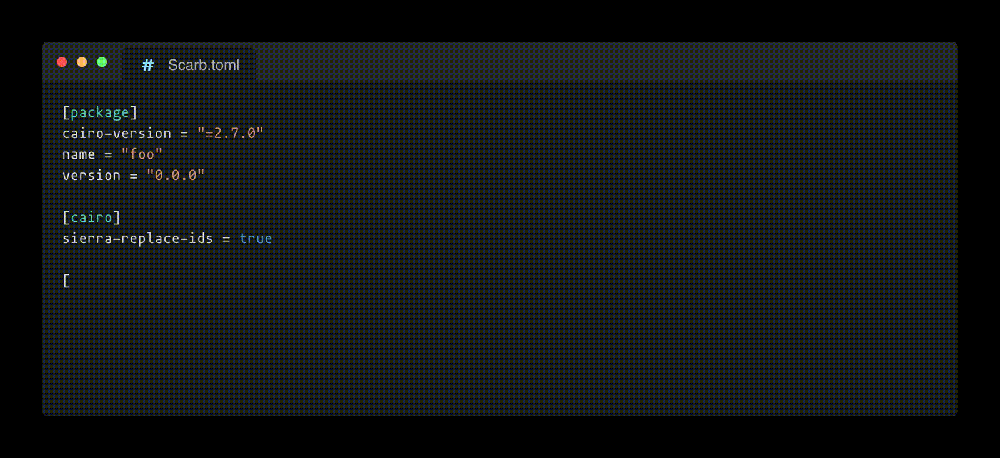

<!-- markdownlint-disable -->
<div align="center">
  
</div>
<div align="center">
  <br />
  <!-- markdownlint-restore -->

  <a href="https://twitter.com/dojostarknet">
    
  </a>
  <a href="https://github.com/dojoengine/dojo">
    
  </a>

[](https://discord.gg/PwDa2mKhR4)
![Github Actions][gha-badge] [![Telegram Chat][tg-badge]][tg-url]

[gha-badge]: https://img.shields.io/github/actions/workflow/status/dojoengine/dojo/ci.yml?branch=main
[tg-badge]: https://img.shields.io/endpoint?color=neon&logo=telegram&label=chat&style=flat-square&url=https%3A%2F%2Ftg.sumanjay.workers.dev%2Fdojoengine
[tg-url]: https://t.me/dojoengine

</div>

# Origami

Origami is a collection of essential primitives designed to facilitate the development of onchain games using the Dojo engine.
It provides a set of powerful tools and libraries that enable game developers to create complex, engaging, and efficient fully onchain games.

> _The magic of origami is in seeing a single piece of cairo evolve into a masterpiece through careful folds_
>
> <p align="right">Sensei</p>

<div align="center">
  
</div>

---

### Crates

| Crate | Content |
|---|---|
| [`origami_defi`](./crates/defi) | Gradual Dutch auctions (discrete, continuous) and VRGDAs (linear, logistic) on `fixed` Q32.32 numbers |
| [`origami_hexmap`](./crates/hexmap) | Hexagonal tile maps: generators, BFS and weighted search, ranges and rings, bit-parallel on one `felt252` |
| [`origami_map`](./crates/map) | Square tile maps: maze, cave and random walk generators, A\*, BFS, DFS, Dijkstra and greedy finders |
| [`origami_random`](./crates/random) | Dice and card decks from a seed |
| [`origami_rating`](./crates/rating) | Elo rating |
| [`origami_security`](./crates/security) | Commit-reveal commitments |

### Installation

Toolchain: [Scarb](https://docs.swmansion.com/scarb) 2.19.4 (Cairo 2.19.4); `origami_hexmap` is
tested with [Starknet Foundry](https://foundry-rs.github.io/starknet-foundry) 0.61.0.

From the [scarbs.xyz](https://scarbs.xyz) registry, one crate at a time:

```sh
scarb add origami_defi@1.8.0
scarb add origami_hexmap@1.8.0
scarb add origami_map@1.8.0
scarb add origami_random@1.8.0
scarb add origami_rating@1.8.0
scarb add origami_security@1.8.0
```

`origami_defi` takes and returns `fixed::Fixed` values: add `scarb add fixed@0.4.0` as well.

Or from git, in your `[dependencies]`:

```toml
[dependencies]
origami_hexmap = { git = "https://github.com/dojoengine/origami", tag = "v1.8.0" }
```

For linear algebra, use the [`nalgebra`](https://scarbs.xyz/packages/nalgebra) and [`glam`](https://scarbs.xyz/packages/glam) packages on scarbs.xyz.

### What's new in 1.8.0

- **Toolchain.** Scarb and Cairo 2.19.4 (from 2.12.2). The crates are published on scarbs.xyz
  for the first time.
- **`origami_algebra` removed**, with its `cubit` dependency: use `nalgebra` or `glam`.
- **`origami_defi` on [`fixed`](https://scarbs.xyz/packages/fixed)** 0.4.0: signed Q32.32
  numbers, range `[-2^31, 2^31)`, resolution `2^-32`; intermediate products are kept wide.
- **New `origami_hexmap`**: hexagonal maps where every operation works on the whole board at
  once. Measured with snforge 0.61.0 (sierra gas, see
  [`GAS.md`](./crates/hexmap/GAS.md)): a 17x14 cave, its connected component, an entrance,
  10 objects and a 15-step path cost 1.14M gas, against 145.8M for the same scenario on
  `origami_map` 18x14 (cairo-test estimate); `search_path` across a 17x14 cave (24 steps) 706k, `new_cave` 142k.

See [CHANGELOG.md](./CHANGELOG.md) for the details.

Now you will be able to use origami like any other Cairo package!

### 🏗️ Join Our Contributors

Your expertise can shape the future of game development! We're actively seeking contributions.

### ❓ Dedicated Support

Run into a snag? Reach out on our [GitHub Issues](https://github.com/dojoengine/origami/issues) or join the conversation in our [Discord community](https://discord.gg/dojoengine) for tailored assistance and vibrant discussions.
